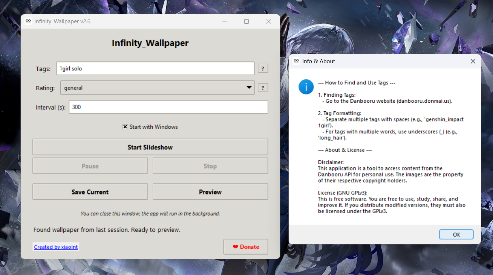

# anime_infinity_wallpaper
 Customize your desktop with an endless slideshow of high-quality images tailored to your tastes.
 


**anime_infinity_wallpaper** is a powerful, feature-rich desktop application for Windows 11 that automatically fetches and sets beautiful anime-style wallpapers from the Danbooru image board. Customize your desktop with an endless slideshow of high-quality images tailored to your tastes.

This application is designed to be set up once and then run quietly in the background, keeping your desktop fresh without any effort.

## Features

* **Dynamic Wallpaper Slideshow:** Automatically downloads and sets new wallpapers at a user-defined interval.
* **Powerful Tagging System:** Use Danbooru's extensive tagging system to find exactly what you're looking for (e.g., `genshin_impact 1girl solo`).
* **Content Rating Control:** Easily select the image rating you're comfortable with, from `General` (SFW) to `Explicit` (NSFW).
* **Smart Aspect Ratio Filtering:** Only downloads images with a 16:9 aspect ratio to perfectly fit modern widescreen monitors.
* **Run in Background:** Close the main window and the app will minimize to the system tray, continuing to work without cluttering your taskbar.
* **Start with Windows:** A simple checkbox allows the application to launch automatically when you log in.
* **Native Windows Notifications:** Get notified when the app starts or when it's minimized to the background.
* **Full Control:** Pause, resume, and stop the slideshow at any time from the user-friendly interface.
* **Save & Preview:** Instantly save any wallpaper you love to a dedicated folder in your Pictures library, or open a fullscreen preview.

## Installation

### For Regular Users (Recommended)

The easiest way to get started is to download the pre-compiled application from the latest release.

1. Go to the **[Releases Page](https://github.com/xiaoint/anime_infinity_wallpaper/releases/tag/v1.0_Release)** on this repository.
2. Download the `Infinity_Wallpaper_Setup.exe` file from the latest release.
3. Run the installer. It will install the application, create a desktop shortcut, and add it to your Start Menu.

### For Developers (Compiling from Source)

If you prefer to compile the application yourself, follow these steps:

1. **Clone the repository:**

```bash
git clone https://github.com/xiaoint/anime_infinity_wallpaper.git
cd Infinity_Wallpaper
```

2. **Install the required Python libraries:**

```bash
pip install requests pillow psutil winotify pystray
```

3. **Install PyInstaller:**

```bash
pip install pyinstaller
```

4. **Compile the executable:**

Run the following command in the project's root directory (where wallpaper_app.py and app_icon.ico are located). This will create a single, distributable .exe file in the dist folder.

```bash
pyinstaller --onefile --windowed --name "Infinity_Wallpaper" --icon="app_icon.ico" wallpaper_app.py
```

## Usage

1. Launch **Infinity Wallpaper**.
2. Enter the **tags** you want to search for, separated by spaces. Use underscores for multi-word tags (e.g., `long_hair`).
3. Select a content **rating**.
4. Set the **interval** in seconds for how often the wallpaper should change.
5. Click **"Start Slideshow"**.
6. You can now close the window. The application will continue running in the system tray (the hidden icons menu on your taskbar). Right-click the icon to show the window again or to quit the application.

## Support the Project

If you enjoy using Infinity Wallpaper, please consider supporting its development! Donations help keep the project alive and motivate future updates and new projects.

<a href="https://coff.ee/XiaoInt" target="_blank">Buy Me a Coffee</a>

## License

This project is licensed under the **GNU General Public License v3.0**. This means it is free and open-source. You are free to use, study, share, and improve it. Any modifications you distribute must also be licensed under the GPLv3.
